# Manuel Utilisateur — Cantine Connect

> Guide d'utilisation de l'application, organisé par rôle. À jour au 2026-08-04.

---

## Sommaire

1. Page d'accueil (publique)
2. Connexion
3. Demande d'accès parent (sans avoir besoin d'un compte)
4. Qui peut voir et faire quoi
5. Tableau de bord
6. Établissements
7. Élèves
8. Mes enfants
9. Paiements Mobile Money
10. Contrôle d'accès à la cantine
11. Historique des passages
12. Rapports
13. Comptes utilisateurs
14. Parents
15. Demandes d'accès (validation par l'administrateur)
16. Paramètres
17. Paiement et notifications — état de la mise en service
18. Support et à propos

> Les sections 5 à 16 suivent l'ordre du menu affiché à gauche de l'écran une fois connecté —
> pour retrouver rapidement une fonctionnalité dans ce manuel, il suffit de la chercher dans le
> même ordre que dans l'application.

---

## 1. Page d'accueil (publique)

Avant de se connecter, toute personne qui arrive sur le site voit une page d'accueil qui présente
l'application : ses points forts (paiement par Mobile Money, entrée à la cantine par QR Code,
suivi des allergies, notifications aux parents), avec deux boutons principaux :

- **Se connecter** — pour les personnes qui ont déjà un compte
- **Demande d'accès** — pour un parent qui n'a pas encore de compte

Ces deux boutons sont aussi disponibles en haut de toutes les pages publiques.

---

## 2. Connexion

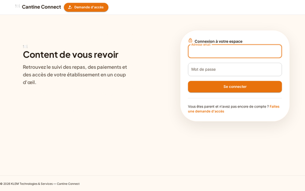

On se connecte avec une adresse email (ou l'identifiant qui a été donné automatiquement aux
parents sans email — voir §15) et un mot de passe. Il n'y a plus d'identifiants affichés à
l'écran par défaut, pour des raisons de sécurité — ils doivent être communiqués séparément par un
administrateur, ou reçus automatiquement quand une demande d'accès est validée (§15).

### Comptes de démonstration (un par rôle)

| Rôle | Email | Mot de passe |
|:--|:--|:--|
| Administrateur | `admin@cantine.connect` | `admin@123` |
| Gestionnaire | `gestionnaire@cantine.connect` | `gestionnaire@123` |
| Caissier | `caissier@cantine.connect` | `caissier@123` |
| Parent | `parent@cantine.connect` | `parent@123` |

Chaque compte doit avoir un **numéro de téléphone unique** (obligatoire à la création) — c'est le
numéro utilisé pour envoyer les notifications par SMS aux parents.

### Habillages visuels

Un **sélecteur d'habillage** (icône palette, visible une fois connecté, en haut de l'écran)
permet de choisir entre trois présentations visuelles. Le choix reste mémorisé sur l'appareil
utilisé.

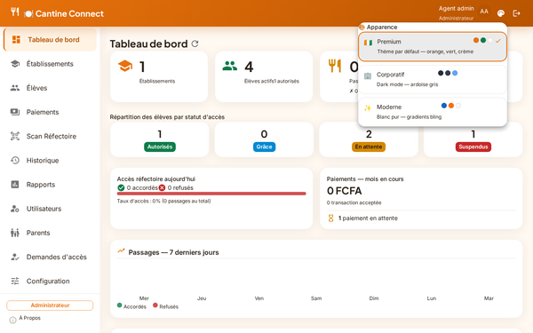

<table>
<tr>
<td align="center"> <strong>Premium</strong> (par défaut) tons orange et vert chaleureux</td>
<td align="center">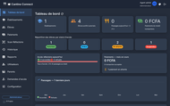 <strong>Corporatif</strong> fond sombre, plus sobre</td>
<td align="center">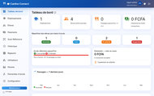 <strong>Moderne</strong> fond blanc, dégradés bleu/orange</td>
</tr>
</table>

---

## 3. Demande d'accès parent (sans avoir besoin d'un compte)

Un parent qui n'a pas encore de compte peut faire une demande depuis la page « Demande d'accès »,
accessible depuis la page d'accueil ou l'écran de connexion. C'est un formulaire simple en trois
petites étapes, avec une barre de progression en haut pour savoir où on en est :

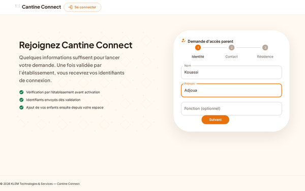

1. **Identité** : nom, prénom, fonction (facultatif — par exemple « Maman », « Tuteur »).

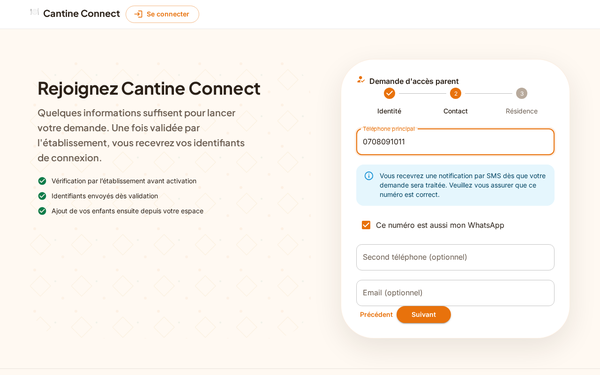

2. **Contact** : numéro de téléphone principal (obligatoire), case à cocher « Ce numéro est aussi
   mon WhatsApp » (sinon un second numéro WhatsApp peut être saisi), second numéro de téléphone
   (facultatif), email (facultatif). Un message rappelle qu'une notification sera envoyée par SMS
   et invite à bien vérifier le numéro saisi.

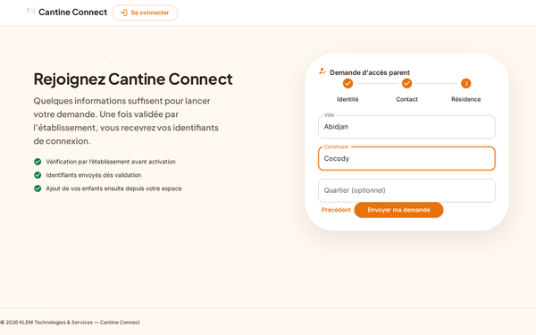

3. **Résidence** : ville, commune (obligatoires), quartier (facultatif).

Le numéro principal, le numéro WhatsApp et le second numéro doivent être au format ivoirien (10
chiffres commençant par 0, par exemple `07 08 09 10 11`, avec l'indicatif `+225` en option) ;
l'email, s'il est renseigné, doit être une adresse valide. Ce contrôle est fait à la fois dans le
formulaire et vérifié une seconde fois par le système, pour éviter toute erreur de saisie.

Une fois les trois étapes remplies, un bouton « Envoyer ma demande » termine le processus et un
écran de confirmation s'affiche :

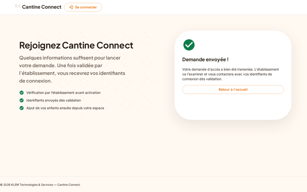

**Aucun compte n'est créé tout de suite** — la demande est mise en attente jusqu'à ce que
l'établissement la valide (voir §15 pour la suite du processus, côté administrateur).

---

## 4. Qui peut voir et faire quoi

| Fonctionnalité | Administrateur | Gestionnaire | Caissier | Parent |
|:--|:-:|:-:|:-:|:-:|
| Tableau de bord | ✓ | ✓ | ✓ | ✓ |
| Établissements | ✓ | ✓ | ✓ | ✗ masqué |
| Élèves | ✓ | ✓ | ✓ | ✗ masqué |
| **Mes enfants** (ajout par le parent lui-même) | — | — | — | ✓ |
| Paiements — voir/lancer un paiement | ✓ (tous) | ✓ (tous) | ✓ (tous) | ✓ (**ses enfants uniquement**) |
| Paiements — modifier/supprimer | ✓ | ✗ | ✗ | ✗ |
| Contrôle d'accès à la cantine | ✓ | ✓ | ✓ | ✗ masqué |
| Historique des passages | ✓ (tous) | ✓ (tous) | ✓ (tous) | ✓ (**ses enfants uniquement**) |
| Rapports (première version) | ✓ | ✓ | ✓ | ✗ masqué |
| Comptes utilisateurs | ✓ | ✗ | ✗ | ✗ |
| Parents (rattacher des enfants) | ✓ | ✗ | ✗ | ✗ |
| **Demandes d'accès** (validation) | ✓ | ✗ | ✗ | ✗ |
| Paramètres | ✓ | ✗ | ✗ | ✗ |

Ces restrictions sont vérifiées par le système lui-même, pas seulement cachées à l'écran : même en
essayant de contourner l'interface, un parent reste limité à ses propres enfants et ne peut pas
accéder aux menus réservés au personnel.

---

## 5. Tableau de bord

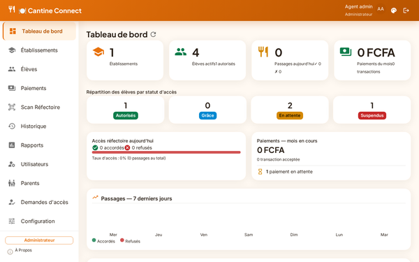

Vue d'ensemble à l'ouverture de l'application : nombre d'élèves, répartition par statut d'accès,
paiements récents, résumé des passages du jour.

- **Administrateur / gestionnaire / caissier** : les chiffres portent sur l'ensemble des élèves.
- **Parent** : les mêmes indicateurs (établissements, élèves, statuts, passages, paiements)
  portent uniquement sur **ses propres enfants** — un parent d'un seul enfant verra par exemple
  « 1 élève », pas le total de l'établissement. Un parent qui n'a encore aucun enfant rattaché
  voit des indicateurs à zéro.

---

## 6. Établissements (administrateur / gestionnaire / caissier)

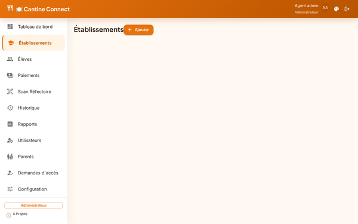

- Liste des établissements actifs. La création d'un nouvel établissement est réservée à
  l'administrateur ; la modification et la suppression (logique, sans perte de données) sont
  possibles pour le personnel autorisé.
- Un outil « Gérer la structure » permet de créer plusieurs niveaux et classes d'un coup (par
  exemple taper `CP, CE1, CM1` crée les trois niveaux en une seule fois), et de les modifier
  directement dans le tableau.
- **Délai de grâce** : un champ optionnel permet de définir, pour cet établissement uniquement,
  un délai différent du délai par défaut (7 jours, réglable dans les Paramètres, §16). Laisser le
  champ vide pour garder le délai par défaut.
- Ce menu n'est pas accessible directement à un parent, mais la liste des établissements et des
  classes lui reste visible pour pouvoir choisir la bonne classe quand il ajoute un enfant
  (§8) — la création ou la modification restent réservées au personnel.

---

## 7. Élèves (administrateur / gestionnaire / caissier)

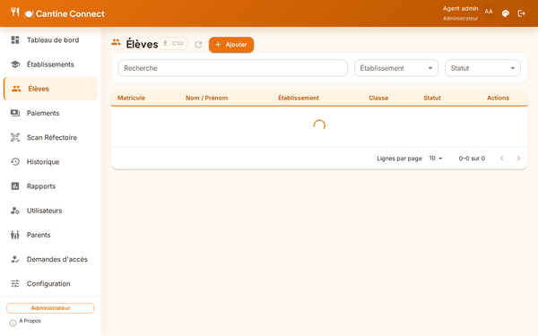

- Liste des élèves avec pagination (reste rapide même avec un grand nombre d'élèves).
- **Recherche** par nom, prénom ou matricule ; filtres par établissement et par statut d'accès.
- **Export** de la liste affichée au format tableau (CSV), via le bouton dédié.
- La création ou la modification d'un élève se fait dans un formulaire en 3 étapes, pour rester
  clair et tenir sur un seul écran :

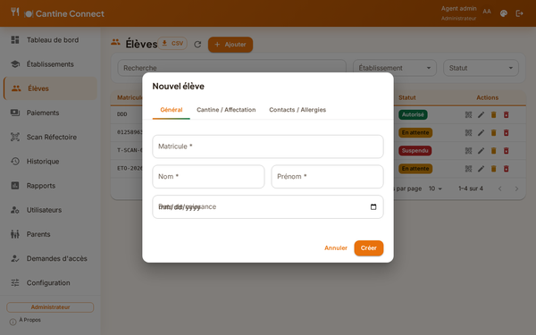
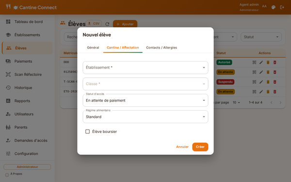
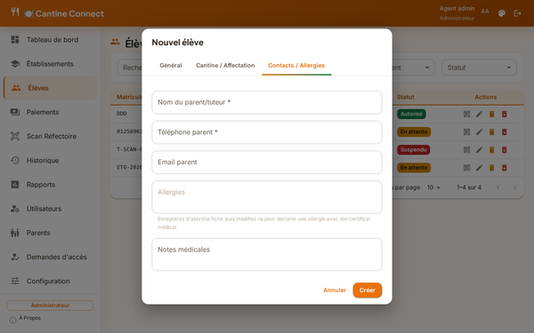

- Chaque élève dispose d'un QR Code personnel : consultable, copiable, imprimable — c'est ce même
  QR Code qui est destiné à être imprimé sur un badge plastifié remis à l'élève (voir l'offre
  commerciale pour la fabrication des badges).
- La suppression d'un élève est réservée à l'administrateur.
- Ce menu n'est pas accessible à un parent (le parent ajoute ses propres enfants depuis
  « Mes enfants », §8).

### Allergies et certificat médical

- Le champ **Allergies** ne peut être renseigné **qu'après la création** de la fiche de
  l'élève, pas au moment de la création : le certificat médical qui l'accompagne ne peut être
  ajouté qu'une fois la fiche déjà enregistrée. Il faut donc d'abord créer l'élève sans allergie,
  puis ouvrir « Modifier » pour la déclarer.
- Une fois en modification, un bloc **Certificat médical** permet d'**ajouter un fichier** (PDF,
  JPG ou PNG). Une fois le fichier envoyé, un repère « Certificat fourni » apparaît avec un lien
  pour le consulter et un bouton pour le remplacer si besoin.
- L'enregistrement de la fiche est bloqué, avec un message clair, si le champ Allergies contient
  du texte mais qu'aucun certificat n'a été ajouté.

---

## 8. Mes enfants (espace parent — en libre-service)

### Ce qui se passe quand un parent se connecte

Une fois connecté avec son email (ou son identifiant) et son mot de passe, un parent arrive
d'abord sur le **Tableau de bord** (§5), avec ses propres statistiques (nombre d'enfants, statut
d'accès, passages récents). Le menu de gauche, spécifique au rôle Parent, ne propose que quatre
écrans : **Tableau de bord**, **Mes enfants**, **Paiements** et **Historique** — tous les menus
réservés au personnel (Établissements, Élèves, Scan Réfectoire, Utilisateurs, etc.) sont absents.
En cliquant sur « Mes enfants » dans ce menu, le parent arrive sur l'écran suivant :

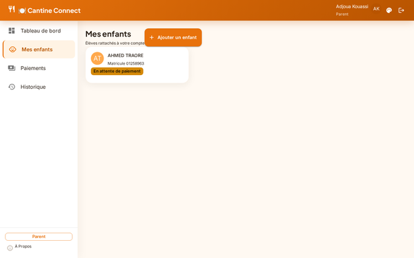

- **Consulter** la liste de ses enfants déjà rattachés : nom, matricule, statut d'accès (Autorisé,
  En attente de paiement, Période de grâce, Suspendu).
- **Ajouter un enfant** lui-même, via le bouton « Ajouter un enfant » qui ouvre un petit
  formulaire :

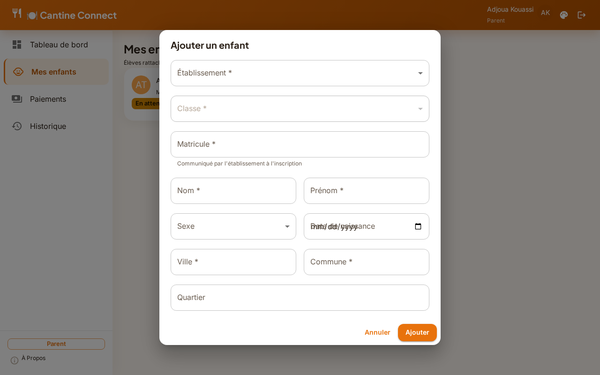

  Le parent choisit l'établissement dans une liste déroulante, puis la classe correspondante
  s'affiche automatiquement une fois l'établissement choisi (les choix proposés dépendent de ce
  que l'administrateur a déjà configuré pour cet établissement), et renseigne le matricule
  (communiqué par l'établissement à l'inscription), le nom, le prénom, le sexe (facultatif), la
  date de naissance (facultative), la ville et la commune (obligatoires), le quartier (facultatif).
- Les coordonnées du parent (nom, téléphone, email) affichées côté établissement pour cet enfant
  sont **reprises automatiquement du compte connecté** — le parent n'a rien à ressaisir.
- Un enfant ajouté de cette façon démarre avec le statut **En attente de paiement** — aucun accès
  à la cantine tant qu'un paiement n'a pas été enregistré (voir §9 pour effectuer ce paiement).

---

## 9. Paiements Mobile Money

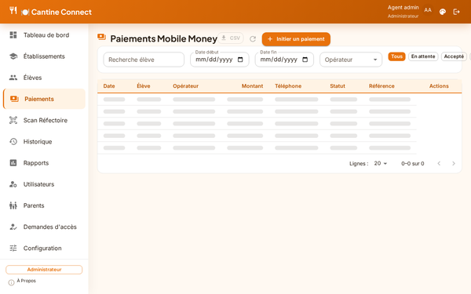

- **Administrateur / gestionnaire / caissier** : voient toutes les transactions et peuvent lancer
  un paiement pour n'importe quel élève (recherche par nom, prénom ou matricule). Seul
  l'administrateur peut modifier ou supprimer une transaction.
- **Parent** : ne voit que les paiements de ses propres enfants ; en lançant un paiement, seuls
  ses enfants lui sont proposés (pas de recherche libre parmi tous les élèves).
- **Périodes de paiement** : pour un abonnement, seuls les règlements **par trimestre ou par
  année** sont proposés — pas de paiement mensuel.
- Opérateurs Mobile Money pris en charge : Orange Money, MTN Money, Moov Money, Wave.
- **Recherche** par nom, prénom ou matricule de l'élève ; filtres par statut (En attente /
  Accepté / Refusé / Annulé), par période (date de début/fin) et par opérateur — tous les filtres
  peuvent se combiner.
- **Export** de la liste affichée au format tableau (CSV).
- Un parent qui tenterait de payer pour un enfant qui n'est pas le sien se voit automatiquement
  refuser l'opération par le système.

> ℹ️ Le paiement en ligne est réellement connecté à un service de paiement Mobile Money, mais
> **aucun compte marchand réel n'est encore branché** — tant que ce n'est pas fait, une tentative
> de paiement affiche un message clair (« service de paiement indisponible ou mal configuré »)
> plutôt qu'un lien de paiement fonctionnel.

---

## 10. Contrôle d'accès à la cantine

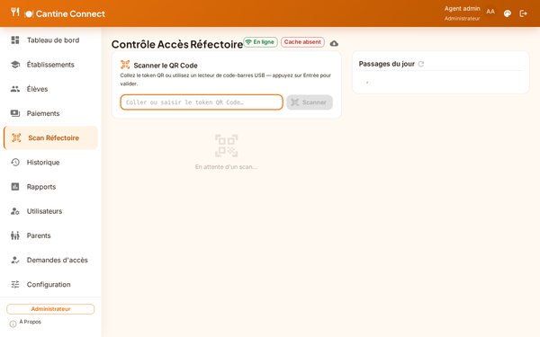

- La lecture du QR Code d'un élève à l'entrée de la cantine confirme l'accès en moins d'une
  seconde : ✓ accès accordé ou ✗ accès refusé (avec le motif affiché).
- Fonctionne même **sans connexion internet** : l'appareil garde en mémoire, pendant 24 heures,
  la liste des élèves et leur statut d'accès, et se remet à jour automatiquement dès que la
  connexion revient.
- Une barre d'état indique si l'appareil est « En ligne » ou « Hors ligne », l'état de ces
  informations enregistrées à l'avance (absentes, ou datées avec le nombre d'élèves couverts), et
  propose un bouton pour forcer la mise à jour manuellement.
- Par défaut, ces informations se mettent à jour automatiquement en arrière-plan dès l'ouverture
  de l'écran, si une connexion est disponible — ce comportement peut être désactivé dans les
  Paramètres (§16) pour ne garder que la mise à jour manuelle.
- Non accessible à un parent.

---

## 11. Historique des passages

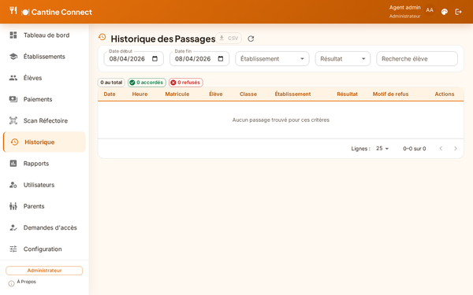

- **Administrateur / gestionnaire / caissier** : historique complet, filtrable par date,
  établissement et résultat, avec recherche d'élève ; export au format tableau (CSV) ; la
  modification ou la suppression d'un passage sont réservées à l'administrateur.
- **Parent** : ne voit que les passages de ses propres enfants ; le filtre par établissement et la
  colonne « Établissement » du tableau sont masqués (non utiles pour un parent).

---

## 12. Rapports (administrateur / gestionnaire / caissier) — première version

> Première version de ce module, mise à disposition pour recueillir des retours avant amélioration.
> Non accessible à un parent.

- On choisit une période (date de début/fin) et, si besoin, un établissement (ce filtre ne
  s'applique qu'aux passages à la cantine), puis on clique sur **« Générer le rapport »**.
- Trois onglets s'affichent une fois le rapport généré :
  - **Résumé** : montant total encaissé, répartition des paiements par statut, répartition des
    passages par résultat, taux d'accès.
  - **Paiements** : liste détaillée des transactions de la période.
  - **Passages** : liste détaillée des passages à la cantine sur la période.
- **Exporter en Excel** : télécharge un fichier avec 3 feuilles (Résumé / Paiements / Passages)
  couvrant toute la période choisie.
- **Imprimer / PDF** (par onglet) : ouvre la fenêtre d'impression du navigateur, limitée au
  contenu de l'onglet affiché — choisir « Enregistrer au format PDF » pour obtenir un fichier PDF.
- Sur une période avec beaucoup de données, un message avertit si le rapport a dû être limité (au
  delà de 10 000 lignes) : il suffit alors de réduire la période choisie.

---

## 13. Comptes utilisateurs (administrateur uniquement)

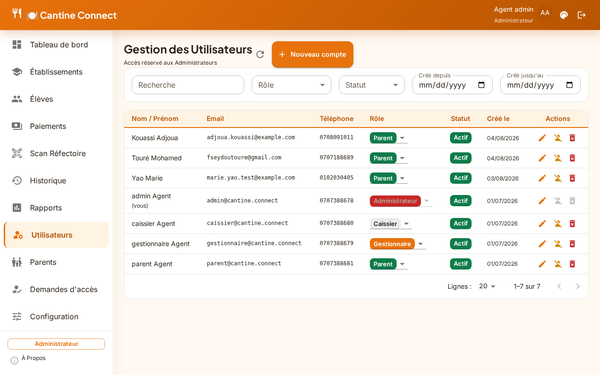

- Création d'un compte : nom, prénom, email, **numéro de téléphone (obligatoire, unique)**, mot
  de passe, rôle (Administrateur, Gestionnaire, Caissier ou Parent).
- Modification, changement de rôle directement dans le tableau, désactivation/réactivation,
  suppression définitive.
- Impossible de désactiver ou de supprimer le tout dernier compte administrateur du système.
- Impossible de désactiver ou de supprimer son propre compte.
- **Recherche** par email, nom, prénom ou téléphone ; filtres par rôle, par statut (actif ou
  inactif) et par période de création — tous combinables.

---

## 14. Parents (rattacher des enfants — administrateur uniquement)

- Permet de rattacher un compte parent à un ou plusieurs élèves.
- **Choix du compte parent** : recherche par numéro de téléphone, nom ou prénom (le compte doit
  déjà exister — le créer d'abord dans « Comptes utilisateurs », ou passer par une demande
  d'accès validée, §15).
- **Choix des enfants** : recherche par matricule, nom ou prénom, plusieurs enfants peuvent être
  sélectionnés à la fois.
- Modification des enfants rattachés, suppression du lien (les fiches des élèves ne sont pas
  supprimées pour autant).
- **Recherche** sur la liste principale par **email ou numéro de téléphone** du compte parent.

---

## 15. Demandes d'accès (validation par l'administrateur)

Sur l'écran « Demandes d'accès » (réservé à l'administrateur), on retrouve la liste des demandes
soumises depuis la page publique (§3), que l'on peut filtrer par statut (En attente / Validées /
Rejetées). Chaque ligne a un bouton « Voir détails » qui ouvre une fiche complète du demandeur
(identité, tous les numéros de téléphone, email, résidence, historique du traitement) — pour une
demande en attente, c'est depuis cette fiche que l'on **valide ou rejette**, afin de toujours
vérifier les informations avant de créer un compte.

- **Valider** : crée le compte du parent, avec un identifiant de connexion et un mot de passe
  provisoire générés automatiquement. Si les notifications par email et SMS sont activées
  (voir §16 Paramètres), le parent les reçoit automatiquement ; **dans tous les cas**, une
  fenêtre affiche l'identifiant et le mot de passe à l'écran, pour pouvoir les communiquer
  manuellement si besoin.
  - Si le parent n'a donné **aucun email**, un identifiant de connexion est créé automatiquement
    à partir de son numéro de téléphone — ce n'est pas une adresse email utilisable, seulement un
    identifiant de connexion.
- **Rejeter** : un motif est obligatoire ; la demande reste visible avec son statut et le motif,
  pour garder une trace.

### Première connexion du parent

Un parent dont le compte vient d'être créé **doit changer son mot de passe provisoire** dès sa
première connexion — l'application l'amène automatiquement sur cet écran et ne laisse pas accéder
au reste du site tant que ce n'est pas fait.

---

## 16. Paramètres (administrateur uniquement)

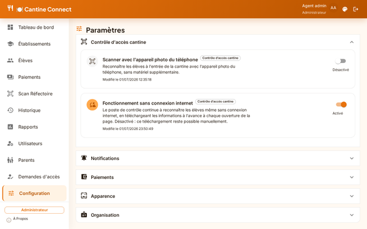

Les réglages sont regroupés par thème dans des blocs dépliables (Contrôle d'accès cantine,
Notifications, Paiements, Apparence, Organisation) — cliquer sur l'intitulé d'un bloc l'ouvre ou
le referme.

- Activer ou désactiver les notifications par email et par SMS.
- Activer ou désactiver la mise à jour automatique des informations hors-ligne du contrôle
  d'accès (§10) — activée par défaut.
- Mode de paiement : par **abonnement** (accès pour tout le trimestre ou l'année) ou par
  **crédits** (montant débité à chaque repas, avec un tarif réglable) — les deux modes peuvent
  coexister, chaque élève utilisant l'un ou l'autre.
- Délai de grâce par défaut (7 jours), qui peut être ajusté établissement par établissement (§6).
- Service de paiement actif.
- Image de fond personnalisée pour l'écran de connexion.

### Personnalisation par établissement (image, nom, coordonnées)

Une section « Organisation » permet d'adapter l'application à l'identité du client :

- **Logo** : à téléverser directement depuis cet écran — il remplace l'icône par défaut en haut
  de chaque page de l'application.
- **Nom du client** : remplace « Cantine Connect » dans l'en-tête de l'application.
- **Adresse / lieu**, **téléphone**, **email** : coordonnées de contact affichées comme
  référence.
- **Numéro Mobile Money** : numéro communiqué aux parents pour un envoi manuel d'argent — c'est
  une information affichée aux parents, elle ne change rien au fonctionnement des paiements en
  ligne (§9).

Tant qu'aucune de ces informations n'est renseignée, l'application garde son apparence par défaut
(icône par défaut et nom « Cantine Connect »).

---

## 17. Paiement et notifications — état de la mise en service

- **Paiement** : la connexion avec le service de paiement Mobile Money est réelle, pas une
  simulation — dès que le client fournit ses identifiants marchands réels, le paiement fonctionne
  sans développement supplémentaire. Sans ces identifiants, une tentative de paiement échoue avec
  un message clair plutôt qu'un lien qui ne fonctionne pas.
- **SMS** : la connexion avec le fournisseur de SMS est réelle. Tant qu'aucun compte n'est
  configuré, les SMS sont simplement enregistrés dans les journaux techniques (aucun envoi réel,
  et cela ne bloque rien pour l'utilisateur).
- **Email** : fonctionne dès que les paramètres techniques d'envoi (compte email dédié) sont
  renseignés.

---

## 18. Support et à propos

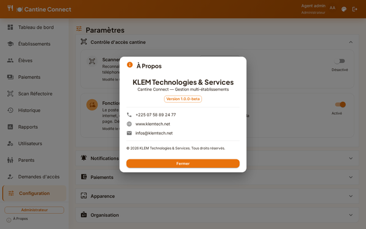

Une fenêtre « À propos », accessible depuis le menu de l'application, rappelle les coordonnées de
contact de l'éditeur :

**KLEM Technologies & Services** — Téléphone : +225 07 58 89 24 77 · Email : infos@klemtech.net
