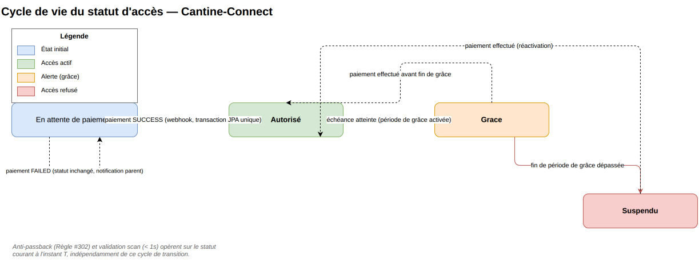
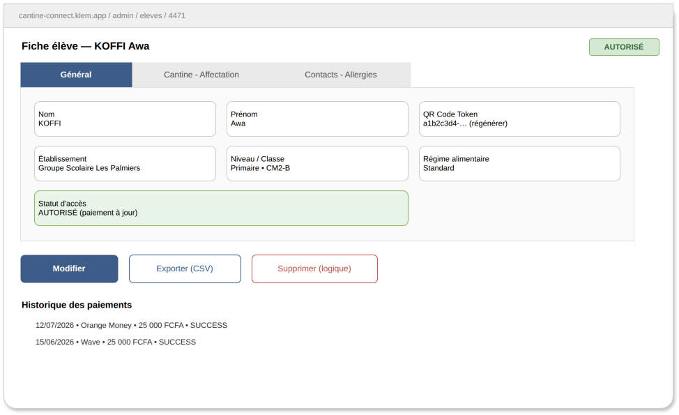
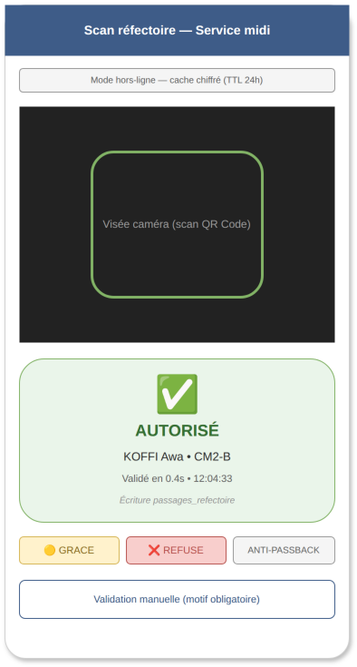
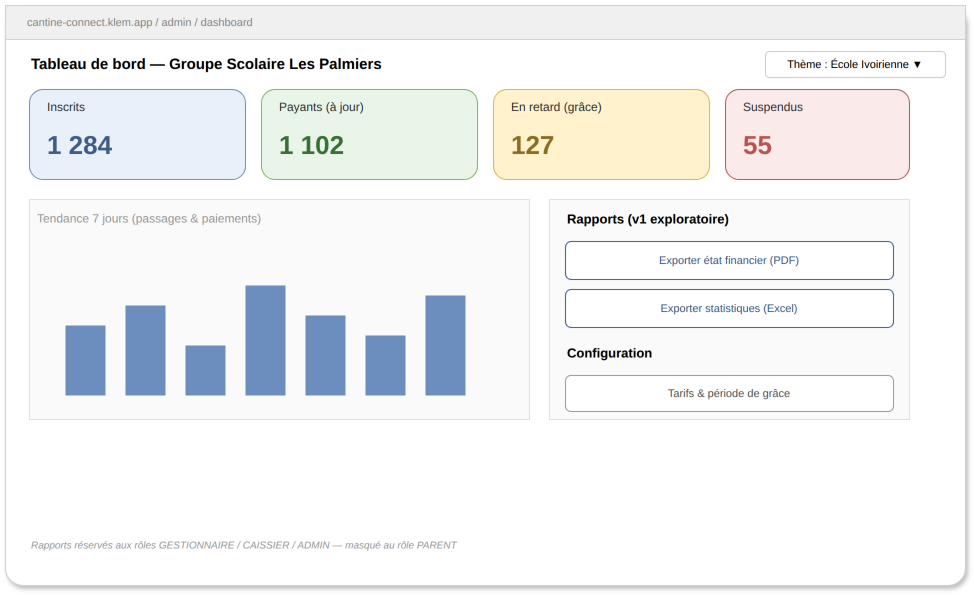

# Spécifications Fonctionnelles — Cantine-Connect

| | |
|---|---|
| **Code Projet** | CTN-SCOL |
| **Propriétaire document** | Yacouba SYLLA |
| **Dernière mise à jour** | 2026-07-19 |
| **Public visé** | Techniciens & Opérationnels — ce que fait le produit, pour qui, et jusqu'où. |

> Documentation détaillée complémentaire : `collaboration/doc/specifications.md` et
> `manuel-utilisateur.md` dans le dépôt applicatif (`apps/web-app/cantine-connect`).

## Sommaire
1. [Contexte](#1-contexte)
2. [Problématique](#2-problématique)
3. [Acteurs et rôles](#3-acteurs-et-rôles)
4. [Cycle de vie du statut d'accès](#4-cycle-de-vie-du-statut-daccès)
5. [Fonctionnalités détaillées](#5-fonctionnalités-détaillées)
6. [Exigences non-fonctionnelles](#6-exigences-non-fonctionnelles)
7. [Hors périmètre (V1)](#7-hors-périmètre-v1)
8. [Backlog Redmine (bloc de synchronisation automatique)](#8-backlog-redmine-bloc-de-synchronisation-automatique)

## 1. Contexte
Cantine-Connect digitalise le paiement Mobile Money et le contrôle d'accès au réfectoire des
cantines scolaires multi-établissements, avec validation QR Code en moins d'une seconde. Le MVP
livré couvre : gestion structurelle multi-établissements (établissements, niveaux, classes),
gestion des élèves (fiche 3 onglets, QR Code, statut d'accès, régime alimentaire), paiement Mobile
Money via agrégateurs (CinetPay/PayDunya), contrôle d'accès réfectoire par scan QR Code (temps réel
+ mode offline), traçabilité exhaustive (`action_log`), gestion des utilisateurs et des comptes
parents, configuration des tarifs/période de grâce, dashboard et rapports exportables.

## 2. Problématique
Les réseaux scolaires gérant la restauration en interne pilotent aujourd'hui le paiement de la
cantine et le contrôle d'accès au réfectoire de façon manuelle : encaissement papier, absence de
traçabilité centralisée par élève, aucun contrôle d'accès temps réel à l'entrée du réfectoire, et
gestion multi-sites non unifiée. Conséquences concrètes : temps administratif élevé, erreurs de
saisie, litiges avec les parents, impossibilité d'audit comptable fiable, risque sanitaire et de
fraude par accès non autorisés, pilotage impossible sur plusieurs établissements à la fois.

## 3. Acteurs et rôles

| Rôle | Description | Actions principales |
|---|---|---|
| **Super Administrateur** (`ADMIN`) | Vision globale tous établissements | Gérer utilisateurs, tarifs, période de grâce, consulter les logs d'audit intégraux |
| **Gestionnaire d'établissement** (`GESTIONNAIRE`) | Restreint à son `etablissement_id` | Gérer élèves, classes, paiements, passages, notifications de son établissement |
| **Agent de scan** (`CAISSIER`) | Personnel de restauration | Valider le QR Code au réfectoire, opérer hors-ligne (cache 24h) |
| **Parent / Tuteur** (`PARENT`) | Restreint côté serveur à ses propres enfants | Consulter paiements et historique de ses enfants ; Établissements/Élèves/Scan entièrement masqués (Règle #504) |
| **Système** | Exécute les webhooks, le scoring de statut et l'audit | Traiter les webhooks de paiement, mettre à jour le statut d'accès, journaliser dans `action_log` |

## 4. Cycle de vie du statut d'accès

### 4.1 Schéma du workflow



Chemin nominal :

```
En attente de paiement --(paiement SUCCESS, webhook)--> Autorisé --(échéance atteinte)--> Grace --(fin de grâce dépassée)--> Suspendu
```

Branches et cas particuliers :

```
En attente de paiement --(paiement FAILED)--> En attente de paiement   (statut inchangé, notification parent, section 5.3)
Grace --(paiement effectué avant fin de grâce)--> Autorisé
Suspendu --(paiement effectué, réactivation)--> Autorisé
```

### 4.2 Statuts

| Statut | Description | Déclenché par |
|---|---|---|
| **En attente de paiement** | Élève inscrit, en attente du premier paiement | Gestionnaire / Parent |
| **Autorisé** | Accès au réfectoire autorisé, paiement à jour | Système (webhook `SUCCESS`) |
| **Grace** | Échéance atteinte, période de grâce active (passage visuel orange, Règle #303) | Système |
| **Suspendu** | Fin de période de grâce dépassée sans paiement | Système |

### 4.3 Opérations clés

| Opération | Description | Déclenchée par |
|---|---|---|
| **Webhook paiement `SUCCESS`** | Passe le statut à `Autorisé` en une seule transaction JPA (Règle #201) | Système (agrégateur CinetPay/PayDunya) |
| **Webhook paiement `FAILED`** | Statut d'accès inchangé, notification au parent (Règle #204) | Système |
| **Échéance de tarif** | Bascule l'élève en période de grâce | Système |
| **Réactivation** | Paiement effectué en `Grace` ou `Suspendu`, retour à `Autorisé` | Système |

## 5. Fonctionnalités détaillées

### 5.1 Gestion structurelle multi-établissements
- **Description** : CRUD établissements, niveaux (Primaire/Collège/Lycée), classes rattachées à une
  année scolaire.
- **Règles de gestion** : masqué au rôle `PARENT` ; un `GESTIONNAIRE` ne voit que son établissement.
- **Critères d'acceptation** : livré et opérationnel.

### 5.2 Gestion des élèves



- **Description** : CRUD complet, formulaire 3 onglets MUI (zéro scroll vertical sur écran compact),
  pagination serveur (max 50/page), recherche, export CSV, import en masse Excel/CSV.
- **Règles de gestion** :
  - Règle #101 — le `qr_code_token` n'est régénérable que par `ADMIN`/`GESTIONNAIRE`, action tracée.
  - Règle #102 — suppression toujours logique (`actif = false`), jamais physique (conformité ARTCI).
  - Règle #103 — pagination serveur obligatoire, taille max 50.
  - Règle #104 — un `GESTIONNAIRE` ne peut créer/consulter que les élèves de son établissement.
- **Critères d'acceptation** : livré ; masqué au rôle `PARENT`.

Source éditable : `wireframes/4.2-fiche-eleve.drawio`.

### 5.3 Paiement Mobile Money
- **Description** : initiation de paiement, réception webhook agrégateur, historique par élève,
  génération de reçu PDF ; transitions de statut détaillées en section 4.
- **Règles de gestion** :
  - Règle #201 — mise à jour du statut d'accès en une seule transaction JPA lors d'un webhook
    `SUCCESS`.
  - Règle #202 — tout webhook doit être vérifié par signature HMAC avant traitement, sinon rejet
    HTTP 401.
  - Règle #203 — `reference_interne` générée avant appel agrégateur (idempotence, pas de double
    paiement).
  - Règle #204 — en cas de `FAILED`, le statut d'accès n'est pas modifié, notification au parent.
  - Règle #205 — détection automatique d'anomalie de paiement (règle de seuil, pas un modèle
    prédictif) : au-delà d'un nombre configurable d'échecs webhook consécutifs sur le même
    agrégateur, une alerte est envoyée à l'équipe support avant que le client ne signale
    l'incident (voir `viabilite_commerciale.md` §"Indicateurs de qualité").
- **Critères d'acceptation** : livré ; `PARENT` limité à ses enfants (filtrage serveur, Règle #504).

### 5.4 Contrôle d'accès & scan QR Code



- **Description** : validation temps réel < 1 seconde, mode offline avec cache chiffré 24h,
  synchronisation différée au retour réseau, mode manuel superviseur avec motif obligatoire.
- **Règles de gestion** :
  - Règle #301 — validation en moins d'une seconde (index sur `qr_code_token`).
  - Règle #302 — anti-passback : un seul passage autorisé par élève et par service.
  - Règle #303 — période de grâce : passage visuel orange si `statut_acces = GRACE` et
    `date_fin_grace >= aujourd'hui`.
  - Règle #304 — snapshot offline chiffré AES-256, données minimales, TTL 24h.
- **Critères d'acceptation** : livré ; entièrement masqué au rôle `PARENT`.

Source éditable : `wireframes/4.4-ecran-scan.drawio`.

### 5.5 Traçabilité & audit (`action_log`)
- **Description** : journalisation immuable de toute action CUD via Spring AOP (`@Auditable`),
  écriture asynchrone, table en écriture seule (aucun UPDATE/DELETE applicatif).
- **Règles de gestion** : capture systématique auteur, horodatage, entité cible, état avant/après.
- **Critères d'acceptation** : livré, couvre élèves, paiements, passages, utilisateurs.

### 5.6 Dashboard, rapports et configuration



- **Description** : KPIs globaux (inscrits, payants, en retard, suspendus), tendance 7 jours,
  export PDF/Excel des états financiers/statistiques, paramétrage des tarifs et de la période de
  grâce.
- **Règles de gestion** : rapports réservés à `GESTIONNAIRE`/`CAISSIER`/`ADMIN`.
- **Critères d'acceptation** : dashboard livré ; module rapports en v1 exploratoire.

Source éditable : `wireframes/4.6-dashboard.drawio`.

## 6. Exigences non-fonctionnelles
- Interfaces compactes sans défilement vertical pour les écrans 13-17" des gestionnaires.
- Application de scan 100% opérationnelle hors-ligne (cache 24h).
- 3 thèmes UI switchables (Corporatif / Moderne / École Ivoirienne), persistés en localStorage.
- Interface en français.

## 7. Hors périmètre (V1)
- Badge NFC (alternative envisagée, non retenue au MVP pour raison de coût).
- Application mobile native pour les parents (web app responsive uniquement).
- Intégration directe avec les systèmes d'information des écoles tierces.
- Authentification à deux facteurs obligatoire côté paiement (actuellement optionnelle côté
  connexion parent — voir point d'attention dans `specifications_techniques.md`).

## 8. Backlog Redmine (bloc de synchronisation automatique)

Ce bloc est traité par `platform-devsecops/scripts/sync_project.py` pour créer automatiquement les
tickets Redmine correspondants lors d'un push sur `master` — voir
`platform-devsecops/specifications_fonctionnelles.md`.

<!-- START_REDMINE_TASKS -->
### US-01: Paiement Mobile Money via agrégateurs avec webhook sécurisé
- **Description**: Intégrer CinetPay/PayDunya avec vérification de signature HMAC sur chaque webhook, référence interne idempotente, et mise à jour du statut d'accès en une seule transaction JPA.
- **Priorité**: Critique

### US-02: Contrôle d'accès réfectoire par scan QR Code
- **Description**: Valider un passage en moins d'une seconde avec anti-passback et mode offline chiffré (cache 24h), y compris l'affichage visuel de la période de grâce.
- **Priorité**: Critique

### US-03: Traçabilité et audit des actions (action_log)
- **Description**: Journaliser de façon immuable toute action CUD via Spring AOP, écriture asynchrone, sans UPDATE ni DELETE applicatif sur la table d'audit.
- **Priorité**: Haute
<!-- END_REDMINE_TASKS -->
