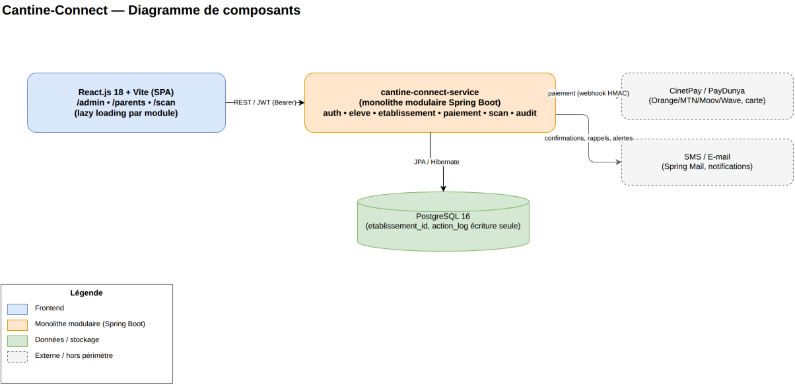
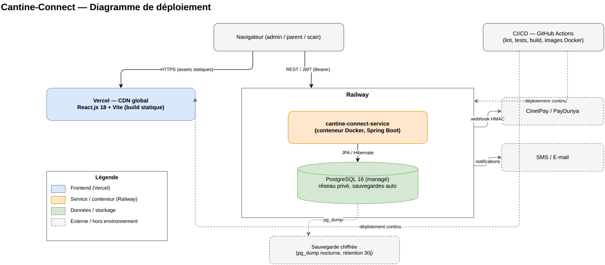

# 🛠️ Spécifications Techniques : CANTINE-CONNECT

> **Code Projet :** CTN-SCOL
> **Auteur :** KLEM Technologies & Services
> **Dernière mise à jour :** 2026-07-09
> **Statut de validation :** Prêt pour MVP (v1.0.0-beta livrée)
> **Public visé :** Techniciens — architecture, stack et choix d'implémentation.
> **Dépôt applicatif :** `apps/web-app/cantine-connect` (monorepo `klem-repo`)

---

## Sommaire
1. [Choix Globaux de la Stack Technologique](#1-choix-globaux-de-la-stack-technologique)
2. [Stratégie de Persistance & Base de Données](#2-stratégie-de-persistance--base-de-données)
3. [Sécurité, Gouvernance & Protection des Données](#3-sécurité-gouvernance--protection-des-données)
4. [Intégrations Externes & APIs Écosystème](#4-intégrations-externes--apis-écosystème)
5. [Déploiement, CI/CD et Infrastructure](#5-déploiement-cicd-et-infrastructure)
6. [Points d'attention R&D](#6-points-dattention-rd)
7. [Feuille de route technique (vers la généralisation multi-établissements)](#7-feuille-de-route-technique-vers-la-généralisation-multi-établissements)
8. [Diagrammes d'architecture](#8-diagrammes-darchitecture)

## 1. Choix Globaux de la Stack Technologique

### 1.1 Front-End
- **Framework** : React.js 18 + Vite, en **JavaScript pur (`.js`/`.jsx`)**. Choix assumé pour
  maximiser la vitesse de développement sur ce projet ; l'absence de typage statique est
  compensée par une discipline stricte de structure (toute logique métier/API dans des custom
  hooks — `useEleves`, `usePaiements`, `usePassages` — jamais dans les composants vues).
- **UI Kit** : Material UI (MUI) v9 exclusivement — uniquement `sx={{}}` et `ThemeProvider`, pas
  de CSS brut. **3 thèmes switchables** (Corporatif, Moderne, École Ivoirienne), persistés en
  localStorage.
- **Routing** : React Router v7 (SPA).
- **Client HTTP** : Axios, instance singleton avec intercepteurs JWT et redirection login sur 401.
- **Performance** : Lazy loading (`React.lazy` + `Suspense`) par module (Admin, Parents, Scan).
- **Interfaces cibles** : `/admin/*` (back-office gestionnaire), `/parents/*` (portail
  mobile-first), `/scan/*` (application de scan, offline-first).

### 1.2 Back-End
- **Framework** : Java 17 + Spring Boot 3.3.5. Architecture en couches strictes
  `Controller → Service → Repository → Entity`, découpage par domaine
  (`com.klem.cantine.[domaine]`).
- **Modules Spring** : Web, Data JPA (Hibernate 6 + JPA Specifications/Criteria API), Security,
  Validation, AOP (audit `action_log`), Mail (notifications), Actuator (healthcheck), Lombok.
- **Migrations** : Flyway, source unique de vérité du schéma.
- **DTO obligatoire** : aucune entité JPA n'est exposée directement à l'API ; tout échange passe
  par des DTOs Request/Response.
- **Zéro logique métier dans les contrôleurs** : validation des entrées puis délégation immédiate
  au service.

### 1.3 Architecture actuelle & trajectoire microservices

Cantine-Connect est aujourd'hui un **monolithe modulaire** : un unique service Spring Boot
déployable, structuré en packages étanches par domaine (`auth`, `eleve`, `etablissement`,
`paiement`, `scan`, `audit`, `common`), chacun respectant la même chaîne
`Controller → Service → Repository → Entity` et l'obligation de DTO aux frontières. Conformément à
`shared_architecture/standards/microservices_&_delivery/specifications_techniques.md`, c'est une étape de trajectoire
assumée et non un écart : le produit est encore au stade MVP/premier pilote, et ce découpage en
modules internes rend une extraction future en services indépendants directe si le volume le
justifie (voir feuille de route, section 7, point 6).

---

## 2. Stratégie de Persistance & Base de Données

- **PostgreSQL 16**, pool HikariCP (max 20 connexions). Indexation stratégique sur
  `qr_code_token` (validation scan < 1s), `operator_tx_id` (réconciliation paiements),
  `etablissement_id`.
- **Entités principales** : `etablissements`, `niveaux`, `classes`, `eleves` (avec
  `qr_code_token` UUID v4, `statut_acces` enum, `regime_alimentaire` enum, `est_boursier`),
  `transactions_paiement` (enum opérateur, statut, agrégateur, `webhook_payload` JSONB),
  `passages_refectoire` (résultat enum, mode hors-ligne, horodatage synchro), `action_log`
  (écriture seule), `utilisateurs`.
- **Isolation (Multi-Tenancy)** : isolation applicative par colonne `etablissement_id` — le
  `JwtAuthFilter` injecte l'`etablissementId` du token dans le contexte de sécurité, et chaque
  `@Service` filtre systématiquement les rôles `GESTIONNAIRE`/`CAISSIER` sur ce périmètre ;
  `ADMIN` sans restriction. Le passage à une isolation renforcée par Row-Level Security
  PostgreSQL est la prochaine étape naturelle de durcissement à mesure que le nombre
  d'établissements servis par une même instance augmente (voir feuille de route, section 7).
- **Suppression logique uniquement** (`actif = false`) sur les entités élèves, jamais physique,
  pour conformité ARTCI (conservation des données).

---

## 3. Sécurité, Gouvernance & Protection des Données

- **Authentification** : JWT stateless HMAC-SHA512 (bibliothèque `jjwt`), transporté en en-tête
  `Authorization: Bearer`, durée de vie 24h. Mots de passe hashés BCrypt (strength 12). Ce
  mécanisme stateless et léger a été retenu pour permettre un scaling horizontal simple du
  backend sans état de session partagé, adapté à la taille du projet ; une bascule vers un IAM
  centralisé (Keycloak/OIDC) deviendra pertinente si Cantine-Connect doit un jour offrir un SSO
  avec d'autres services KLEM consommés par les mêmes établissements.
- **RBAC serveur strict** : rôles `ADMIN`, `GESTIONNAIRE`, `CAISSIER`, `PARENT`. Le rôle `PARENT`
  est restreint **côté serveur** (`@PreAuthorize`, filtrage repository via
  `ParentRepository.findEnfantIdsByUtilisateurId()`), pas seulement côté interface — un parent ne
  peut consulter/agir que sur ses propres enfants, vérifié y compris en appel API direct.
- **Webhooks paiement** : vérification de signature HMAC obligatoire avant traitement, rejet
  HTTP 401 sinon ; idempotence garantie par `reference_interne` générée avant l'appel agrégateur.
- **Traçabilité** : table `action_log` alimentée par Spring AOP (`@Auditable`), écriture
  asynchrone, écriture seule (aucun UPDATE/DELETE applicatif) — couvre élèves, paiements,
  passages, utilisateurs.
- **Chiffrement** : TLS en transit ; chiffrement AES-256 des données d'identité sensibles
  (allergies, contacts) et du snapshot offline de l'application de scan (TTL 24h).
- **Conformité ARTCI** : hébergement sur territoire africain, accès aux profils élèves restreint
  par rôle, droit à l'effacement/portabilité prévu contractuellement.
- **Authentification du paiement** : le parent s'authentifie par email/mot de passe (option OTP
  SMS) pour accéder au portail, puis le paiement lui-même est finalisé sur la page hébergée de
  l'agrégateur (CinetPay/PayDunya), qui porte son propre contrôle KYC/3-D Secure côté opérateur.
  Rendre l'OTP SMS **systématique** (et non optionnel) à l'ouverture de session parent est la
  priorité de durcissement la plus directement liée à la protection financière des familles avant
  généralisation à l'ensemble du réseau (voir section 7).

---

## 4. Intégrations Externes & APIs Écosystème

- **Paiement Mobile Money** : agrégateurs **CinetPay** et **PayDunya**, couvrant Orange Money, MTN
  MoMo, Moov Money, Wave, ainsi que carte Visa/Mastercard (frais +1% à la charge du parent) et
  virement bancaire (confirmation manuelle).
- **Notifications** : SMS et e-mail (Spring Mail) pour confirmations de paiement, rappels
  d'échéance (J-7/J-3/J-1), alertes de suspension d'accès.
- **Export** : reçus/factures PDF, rapports Excel (module rapports en v1 exploratoire).

---

## 5. Déploiement, CI/CD et Infrastructure

- **Frontend** : Vercel — build Vite natif, CDN global, `vercel.json` avec rewrite SPA
  (indispensable pour React Router, sinon 404 sur les routes profondes).
- **Backend** : Railway — Docker multi-stage (`eclipse-temurin:17-jdk-alpine` →
  `17-jre-alpine`), `ENTRYPOINT` en forme JSON pour la propagation correcte des signaux d'arrêt,
  healthcheck sur `/actuator/health` (timeout 120s pour laisser le temps aux migrations Flyway au
  premier démarrage), port dynamique via `${PORT:8081}`.
- **Base de données** : PostgreSQL managée par Railway (plugin intégré, sauvegardes automatiques,
  réseau privé partagé avec le backend).
- **Environnement local** : Docker Compose (`postgres:16-alpine` + pgAdmin).
- **CI/CD** : GitHub Actions — lint + tests unitaires sur push `develop`/`main`, build
  (`./mvnw clean package` + `npm run build`), génération d'image Docker et push registre privé,
  déploiement continu automatique sur push (Vercel + Railway). Ce déploiement découplé sur deux
  PaaS spécialisés a été choisi pour livrer une infrastructure production sans gestion serveur en
  moins d'une journée, au coût adapté à un lancement pilote ; une bascule vers une orchestration
  unifiée (Kubernetes ou équivalent) reste ouverte si le volume ou une exigence de souveraineté
  l'impose à l'échelle du réseau complet.
- **Sauvegarde** : `pg_dump` automatique nocturne (02h00), chiffrement de l'archive, export vers
  stockage objet distant, rétention 30 jours.

---

## 6. Points d'attention R&D
- Pas de révocation de token JWT avant expiration (24h) : un compte désactivé reste actif jusqu'à
  expiration du token déjà émis — une blacklist Redis est la solution à activer si un cas d'usage
  critique l'exige.
- Le module Rapports est en v1 exploratoire (export PDF/Excel côté navigateur) : à consolider
  avant généralisation à tous les établissements.
- Filtrage `PARENT` dupliqué entre `PaiementService` et `ScanService` plutôt qu'une abstraction
  commune — acceptable au nombre de cas actuel (2), à surveiller si le nombre de restrictions par
  rôle augmente.
- Dépendance à deux fournisseurs cloud distincts (Vercel + Railway) — couplage faible jugé
  acceptable au stade pilote.

---

## 7. Feuille de route technique (vers la généralisation multi-établissements)

Ces évolutions prolongent l'architecture actuelle plutôt que de la remettre en cause ; elles sont
classées par priorité pour accompagner la croissance du nombre d'établissements et d'élèves :

1. **OTP SMS systématique à la connexion parent** (et non plus optionnel) : c'est la mesure de
   durcissement la plus directement liée au risque financier des familles, à traiter avant la
   généralisation à tout le réseau.
2. **Row-Level Security PostgreSQL** sur `etablissement_id`, en défense en profondeur du filtrage
   applicatif déjà en place, à activer quand le nombre d'établissements servis par une même
   instance justifie une isolation renforcée au niveau base de données.
3. **Révocation de token** (liste noire Redis ou introduction d'un refresh token courte durée),
   pour couvrir le cas d'un compte désactivé en cours de session.
4. **Consolidation du module Rapports** (formats d'export, performance sur de gros volumes) avant
   déploiement à l'ensemble des établissements du réseau.
5. **SSO inter-projets KLEM** : si Cantine-Connect doit un jour être consommé conjointement avec
   d'autres services du portefeuille KLEM par les mêmes établissements, une bascule progressive
   vers un IAM centralisé (Keycloak/OIDC) permettrait une authentification unifiée — non
   prioritaire tant que le produit reste autonome.
6. **Extraction de services indépendants** depuis le monolithe modulaire actuel (candidats
   naturels : `paiement-service` pour isoler la charge des webhooks agrégateurs, `scan-service`
   pour isoler la charge de validation temps réel côté réfectoire), à déclencher par la charge
   mesurée ou un besoin de cycle de déploiement distinct — pas par anticipation, conformément à la
   trajectoire de décomposition du standard `shared_architecture/standards/microservices_&_delivery/specifications_techniques.md`.
7. **Mise à l'échelle horizontale (Citus)** : non pertinent à l'échelle actuelle (pilote sur
   quelques établissements) ; à réévaluer uniquement si Cantine-Connect devait un jour servir un
   grand nombre de réseaux scolaires clients distincts sur une même instance PostgreSQL — voir
   `shared_architecture/data_pipeline/specifications_techniques.md`, section 6. Non prioritaire aujourd'hui.

---

## 8. Diagrammes d'architecture

### 8.1 Diagramme de composants

Vue logique des composants : le frontend React.js 18 + Vite (SPA, modules `/admin`, `/parents`,
`/scan` en lazy loading) consomme en REST/JWT le monolithe modulaire `cantine-connect-service`
(section 1.3), qui persiste sur PostgreSQL 16 via JPA/Hibernate (section 2), reçoit les webhooks
signés HMAC des agrégateurs CinetPay/PayDunya et envoie les notifications SMS/e-mail (section 4).
Le découpage interne en packages étanches (`auth`, `eleve`, `etablissement`, `paiement`, `scan`,
`audit`) rend une extraction future en services indépendants directe si le volume le justifie
(feuille de route, section 7, point 6), sans remettre en cause ce schéma logique.

Source éditable : `architecture_composants.drawio` (ouvrable dans draw.io desktop ou
[app.diagrams.net](https://app.diagrams.net)).

### 8.2 Diagramme de déploiement

Vue infrastructure : le frontend est servi par Vercel (CDN global, build Vite statique), le
backend par Railway (conteneur Docker Spring Boot + PostgreSQL managé en réseau privé, section 5).
Les pipelines CI/CD GitHub Actions déploient en continu sur les deux PaaS à chaque push. Une
sauvegarde chiffrée (`pg_dump` nocturne, rétention 30 jours) complète la persistance managée. Ce
couplage à deux fournisseurs cloud distincts est un choix assumé de rapidité de mise en production
pour un lancement pilote (section 6), pas une contrainte définitive.

Source éditable : `architecture_deploiement.drawio`.
